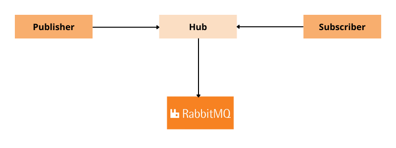

# A Websub Hub Based on RabbitMQ

# Overview

This is a websub hub implementation is based on message brokers. In this case we have used RabbitMQ message broker to implement the websubhub APIs. Message brokers are a natural fit for the implementation of websub hubs as they serve a similar purpose. However, regardless of the APIs used to publish messages to the hub, websubhub APIs can be used to implement websub hubs which are fully compliant with the websub specification.

# Implementation and Usage



## Installing and Starting RabbitMQ

Follow the guide [Downloading and Installing RabbitMQ](https://www.rabbitmq.com/download.html), to install and start the RabbitMQ server.

## Starting the Hub
Once those servers are up and running the hub can be started using the following commands. Go into `hub` directory and run following command to build the project.
```shell
bal build 
```

Then to run the project execute the below command.
```shell
bal run target/bin/rabbitmqHub.jar
```

### Starting Multiple Hub Instances

* Copy the `rabbitmqHub.jar` to another location.

* Copy the `Config.toml` which you could find in the project root directory.

* Change the `SERVER_ID` and `HUB_PORT`.

* Go into that location and run the following command.
```shell
bal run rabbitmqHub.jar
```

## Registering Topics
Once all prerequisites are completed, the first interaction to the hub could be made by registering a topic. We have included a sample to understand the usage of `websubhub:PublisherClient` in the `publisher` directory inside the project. Execute the following command to build the `topic_registration_client.bal`.

```shell
bal build topic_registration_client.bal
```

Then execute the below command to run the program.

```shell
bal run topic_registration_client.jar
```

## Subscribing to the Hub
Now we have registered a `topic` in the hub. Next we could subscribe to the previously registered `topic` using `websub:SubscriberService`. Build `subscriber_service.bal` inside `subscriber` directory inside the project using the following command.

```shell
bal build subscriber_service.bal
```

Then execute the below command to run the program.

```shell
bal run subscriber_service.jar
```

## Publishing to the Hub
Content publishing could be considered as the final stage of interaction between a publisher, hub and subscriber. `websubhub:PublisherClient` has support to publish content to the hub. Find the `content_publish_client.bal` located in `publisher` directory and execute the following command to build the program.

```shell
bal build content_publish_client.bal
```

Then execute the below command to run the program.

```shell
bal run content_publish_client.jar
```
